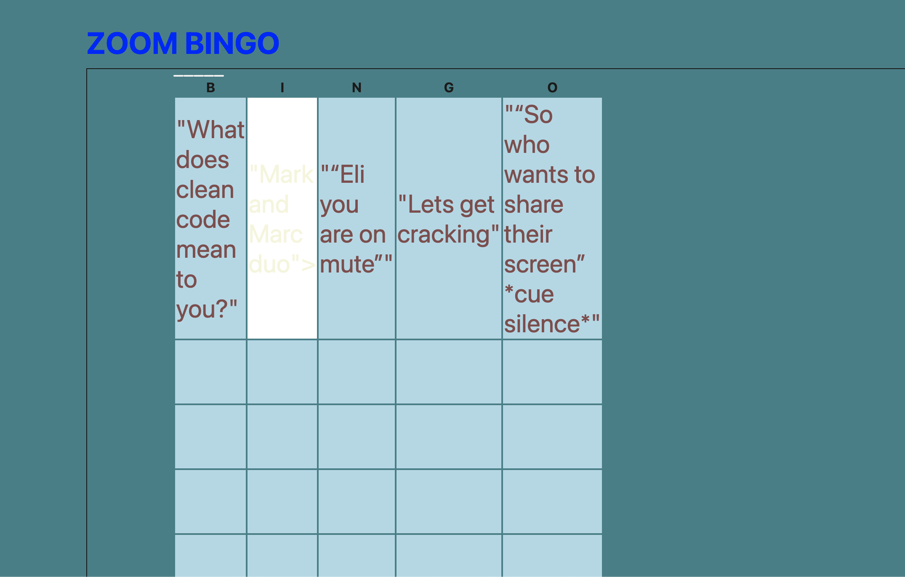

# zoom-bingo

## Description

This is a fullstack web application that allows you to play a Zoom themed bingo game. In the frontend, handlebars.js is used as well as the MVC paradigm. It is configured to use Sequelize to interact with a MySQL database. 

## Installation

### Prerequisites-local machine

This app uses Node.js MySQL so you will need to install all of these.

## Usage

**Project setup**

- Clone down this repository locally
  `git clone git@github.com:mlhalbert/zoom-bingo.git`
- You will need to install
  - `nvm`
  - `npm`
  - `mysql`
  - `express.js`
  - `dotenv`
  - `sequelize`
  - `bcrypt`
  - `express-handlebars`
  - `express-session`
  - `eslint`
  - `eslint-config-prettier`

- Setup a mysql database
- Use the `.env.EXAMPLE` file and setup your credentials
- login to `mysql`
  - create schema: `mysql -u root -p`
  - `SOURCE db/schema.sql`
  - exit mysql
- in Terminal:
  - seed database `node seeds/seed.js`
  - start app server `npm start`

\*_Use the command to run the app_
`node server.js`

## Credits

Tutorials:

- [U of MN Coding Bootcamp Link](https://github.com/coding-boot-camp)
